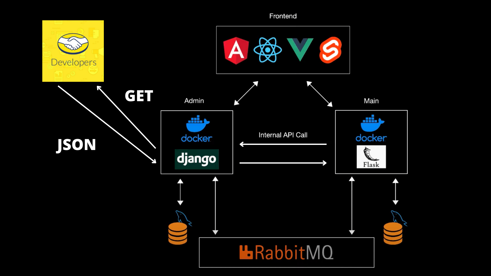

<p align="center"></p>

# Using DRF and Flack with RabbitMQ (EDD)

Flask, Django Rest Framework, RabbitMQ, and MySql, along with Docker to create two web services that generate content dynamically and asynchronously.

## Project Structure

The finished project structure will be as follows:


```
Django Rest Framework:
.
├── apps
│   └── mercado_libre
│   │   ├── confing.ini
│   │   ├── meli.py
│   │   ├── services.py         (important)
│   │   └── ssl_helper.py
│   └── products
│       └── api
│       │    ├── api.py         (important)
│       │    ├── producer.py    (important)
│       │    ├── routers.py
│       │    └── serializers.py
│       ├── admin.py
│       ├── apps.py
│       └── models.py
├── nextia
│   ├── asi.py
│   ├── settings.py
│   ├── urls.py
│   └── wsgi.py
├── consumer.py                 (important)
├── Dockerfile
├── docker-compose.yml
├── manege.py
└── requirements.txt
```

```
Flask:
.
├── controllers
│   └── product_controller.py
├── models
│   └── Product.py
├── utils
│   └── db.py
├── app.py
├── config.py
├── consumer.py                 (important)   
├── Dockerfile
├── docker-compose.yml
└── requirements.txt
```

## Using Docker to package our application


To create and run the container in case of Django, use:

    docker-compose build
    docker-compose up -d back-django

To create and run the container in case of Flask, use:

    docker-compose build
    docker-compose up -d back-flask

